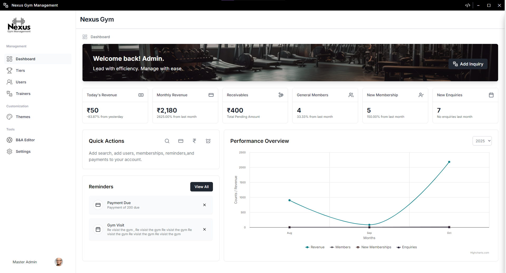
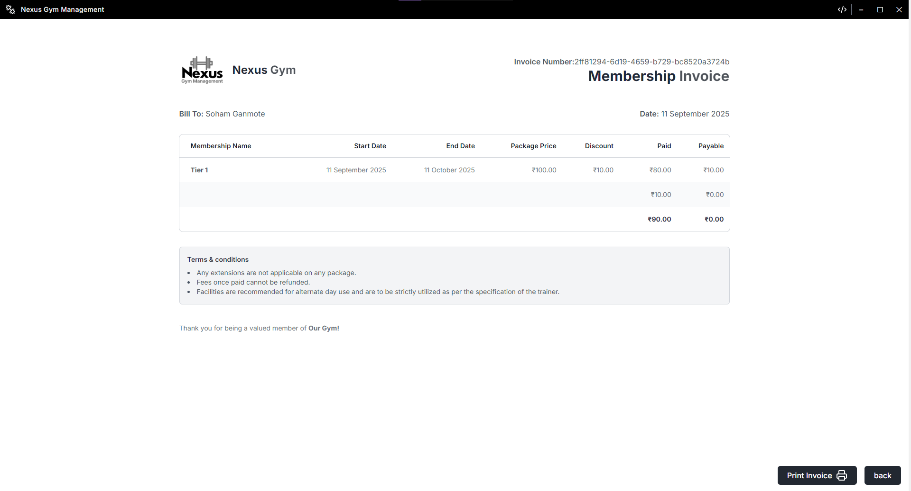
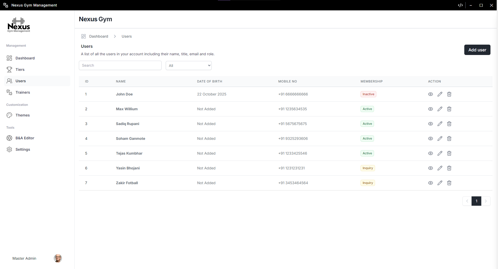

# Nexus 🏋️‍♂️

**Nexus** is a powerful **standalone offline gym management tool** designed to simplify the management of your gym. Built with modern technologies, Nexus helps you handle inquiries, subscriptions, invoicing, trainers, and much more – all from your desktop, without the need for an internet connection.

---

## Features ✨

- Manage **inquiries** and new members
- Track **subscriptions** and memberships
- Generate **invoices** and billing records
- Manage **trainers** and staff
- Dashboard for quick **overview and reporting**
- Fully **offline** – no internet required
- User-friendly interface with smooth UI

---

## Tech Stack 🛠️

- **Electron JS** – For cross-platform desktop app
- **React + Vite** – Frontend development
- **Tailwind CSS** – Modern styling
- **SQLite** – Lightweight local database

---

## Screenshots 📸

---

## Download Setup ⬇️

You can download the latest setup for **Nexus** here:
[Download Nexus Setup](https://drive.google.com/file/d/1Gpdj0U_0kCDNoEk_mxPVajwZhu-GhcOK/view)

---

## Full Video Explanation 🎥

Watch a full walkthrough of **Nexus** on YouTube:
[Full Nexus Video](https://www.youtube.com/watch?v=CYzYyEHd5zs)

---

## Contributions 🤝

Contributions are welcome! If you want to help improve Nexus, feel free to:

1. Fork the repository
2. Make your changes
3. Submit a pull request
